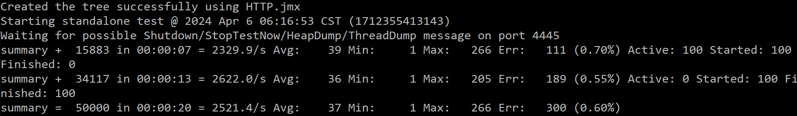

# Dcard backend assignment

## 設計想法
1. 因為資料不大，其實使用Redis會更好，但我目前對SQL更為熟悉，加上本學期也在學DBMS架構。同時也當作練習，所以選擇使用PostgreSQL作為database，利用Go的postgres driver "pq"函式庫來做資料庫連線
2. 使用Go的gorilla/mux來建立server
3. 使用PostgreSQL的docker container來連接
4. 在Post上，使用因為將country decompose到不同table，所以利用transection來確保資料的一致性。
5. 在Get上，透過將各種條件parse到query上，讓PostgreSQL自行去利用planner來找出最有效的資料取得。
5. 使用Makefile來設定指令。
6. 正確性測試中，使用go的testing功能來做API的單元測試。
7. 壓力測試使用jmeter。

## 程式碼架構
```
|- Project
|  |- api/v1/ad
|  |  |- ad.go               定義api會使用到的資料結構
|  |  |- get.go              Get method
|  |  |- post.go             Post method
|  |- bin                    輸出執行檔(gitignore)
|  |- cmd                    Server主程式
|  |  |- config
|  |  |  |- config.go        讀取資料庫配置
|  |  |- connect
|  |  |  |- connect.go       定義與資料庫的連線
|  |  |- router
|  |  |  |- router.go        定義API路由
|  |  |- utils
|  |  |  |- utils.go         其他常用函式
|  |- configs 
|  |  |- config.json         定義資料庫配置
|  |- test/api/v1/ad
|  |  |- ad.go               定義測試資料的資料結構
|  |  |- get_test.go         測試get的正確性
|  |  |- post_test.go        測試post的正確性
|  |  |- post_test.go        測試post的正確性
|  |  |- adTestingData.json  隨機生成的資料，用於測試Get
|  |  |- get.json            Get method的測試資料
|  |  |- post.json           Post method的測試資料
|  |- main.go                進入點，啟動server，開啟port
|  |- Makefile               使用Makefile簡化指令操作
```


## 正確性測試
### Post
```sh
make test_post
```
在post當中，主要測試invalid的input是否會reject掉。
### Get
```sh
make test_get
```
在get當中，先隨機生成數筆資料，post到資料庫當中，再根據幾筆測試資料，查看回傳items正確與否。

## Conclusion and Future work
1. 我在要求的功能上皆能正常運作
2. 但在壓力測試中，我自己的環境裡，1000筆資料中，對get method只能跑出大約2300次/s多的效能，而且若user太多，server也會自行reject掉request。
   
   如果要嘗試改善的話，我想能透過Redis來做資料cache。我的測試資料是隨機生成，但實際情況，資料從database讀取有相當大的locality，像是EndAt多半會使用較接近現在時間的。這樣能大幅減少access disk的時間。甚至在資料不大的情況，其實可以直接全部使用Redis會有最快的速度。
   
   此外，在實際佈署時，可以使用kubernetes之類的工具去做load balance，根據資料範圍，像是國家，年齡區間等分散到不同的節點上，然後節點上再做cache，我認為能大幅提升效能。
 (同時 50 users)
3. 在簡化指令操作上，我簡單的使用make來代替，若在實際專案，可透過Ansible之類的工具來強化CI的功能性

## 環境設定
### Set up postgresql with docker
```sh
docker run -d --name my-postgres -p 8888:5432 -e POSTGRES_PASSWORD=admin postgres:14-alpine3.17
```

### Compile and run

```sh
make
./bin/a.out
```

### Create table (Not necessary)
* Since the above container doesn't use volume to store data, we have to initiate table at first.
* Decompose country data to seperate table since the number of countries can be too many.
* These queries will be done while this application start.
```sql
CREATE TABLE Ad (
    ID SERIAL PRIMARY KEY,
    Title text NOT NULL,
    StartAt timestamp NOT NULL,
    EndAt timestamp NOT NULL,
    AgeStart int,
    AgeEnd int,
    Male boolean,
    Female boolean,
    PlatformAndroid boolean,
    PlatformIos boolean,
    PlatformWeb boolean,
);
CREATE TABLE Country (
    ID NOT NULL references Ad(ID),
    Country char(2),
    PRIMARY KEY (ID, Country)
);
```

## 範例request
### Post
```sh
curl -X POST -H "Content-Type: application/json" "http://localhost:3000/api/v1/ad" \
-d '{"title":"AD 55", 
    "startAt":"2023-12-10T03:00:00.000Z",
    "endAt":"2023-12-31T16:00:00.000Z",
    "conditions": {
            "ageStart": 20,
            "ageEnd": 30,
            "country": ["TW", "JP"],
            "platform": ["android", "ios"]
        
    }  
}'
```
### Get
```sh
curl -X GET -H "Content-Type: application/json" \
"http://localhost:3000/api/v1/ad?offset=10&limit=3&age=24&gender=F&country=TW&platform=ios"

```